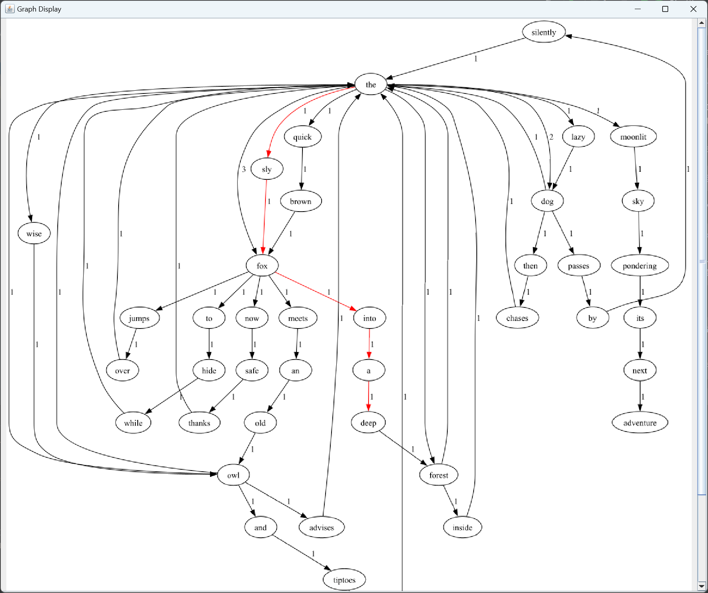

# Lab1-Graph

运行依赖绘图工具 graphviz，需要安装 [下载地址](https://graphviz.org/download/)

## Feature

功能需求1：输入一个英文书写的文本文件，生成有向图

> 边上的权重w=文本中A和B相邻出现的次数  
> 用户可以通过命令行参数 -f / --file 指定文件路径

功能需求2：展示生成的有向图

> 展示有向图
> 
> ✅ 可选功能：将生成的有向图以图形文件形式保存到磁盘  
> 
> 绘图工具：graphviz
> Java API: https://github.com/nidi3/graphviz-java

功能需求3：查询桥接词（bridge words）

> 输入任意两个英文单词word1、word2，程序从图中查询它们的“桥接词”  
> word1、word2的桥接词word3：图中存在两条边word1→word3, word3→word2

功能需求4：根据bridge word生成新文本

> 输入一行新文本，程序计算相邻单词的桥接词并插入

功能需求5：计算两个单词之间的最短路径

> 用，程序计算它们之间在图中的最短路径，并标注在原图上
> 
> ✅ 可选功能：如果用户只输入一个单词，则程序计算出该单词到图中其他任一单词的最短路径，并逐项展示出来

功能需求6：随机游走

> 程序随机的从图中选择一个节点，以此为起点沿出边进行随机遍历
> 
> 将遍历的节点输出为文本，并以文件形式写入磁盘
> 
> 用户可以输入 `i` 终止游走

